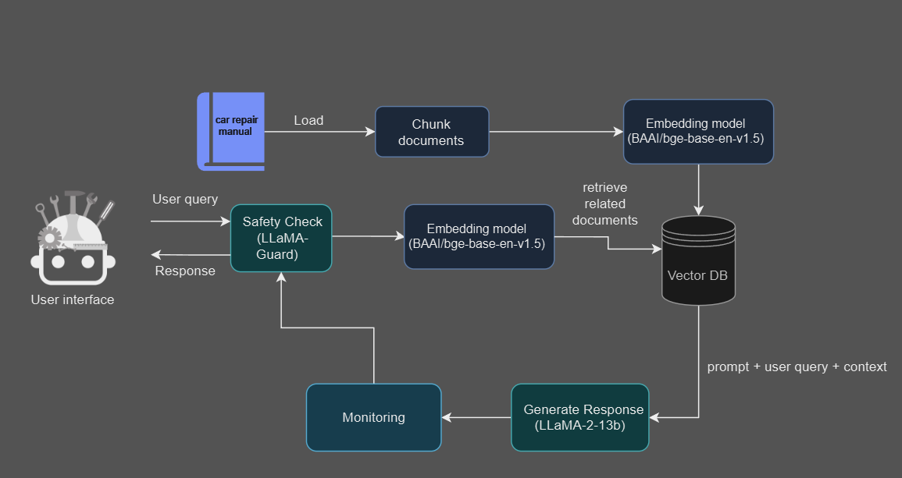
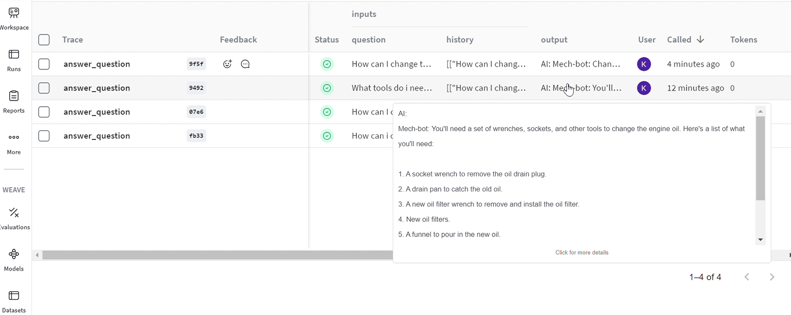
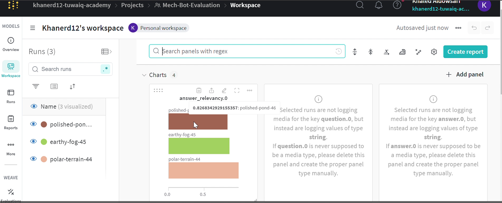

<picture align="center"></picture>
# 🛠 Mech-bot🤖🔧

The Mech-Bot project aims to create an intelligent chatbot that assists car owners in diagnosing and solving car-related issues. The target audience includes individual car owners and small repair shops. This chatbot will leverage the latest advancements in Natural Language Processing (NLP) and machine learning to provide accurate and timely assistance. Mech-Bot will be implemented using the Retrieval-Augmented Generation (RAG) framework, which combines the strengths of retrieval-based and generation-based approaches to provide more precise and contextually relevant answers.

### 🎯Scope:

The initial version of Mech-Bot will focus on diagnosing common car problems and providing maintenance tips. The chatbot will use a database of car repair manuals, which will be collected in PDF format. These manuals will serve as the primary source of information for Mech-Bot, enabling it to provide detailed and accurate responses to user queries.

### 📚🔧Data to Use:r
repair Manuals: Detailed, step-by-step instructions on car maintenance and repair, available in digital formats like PDFs, and loaded using PyMuPDF.

### 🏛️Mech-bot architecture:
<picture align="center"></picture>

# Mech-Bot Developer's Tutorial
---

Welcome to the Mech-Bot Developer's Tutorial! This guide will walk you through setting up, running, and customizing the Mech-Bot project, a car mechanic assistant chatbot powered by LLaMA models.

## prerequisites

Before you start, make sure you have the following:

- Python 3.8+
- Jupyter Notebook (or Google Colab for running the notebook in the cloud)

- PyTorch (with GPU support if available)

- Hugging Face Transformers library
Gradio for the chat interface

- WandB (Weights and Biases) API key for monitoring and logging

- Togather AI account to obtain an API key for using its services

- Google Colab to run the notebook in a cloud environment

Ensure you have access to these resources to develop and run Mech-Bot smoothly.

## To open Mech-bot in Google Colab:

### Step 1: Download Required Files
1. **Download `Mech-bot_DATA(text).pdf`**:
This file contains the data necessary for the chatbot.

2. **Download `Mech_bot(main code).ipynb`**:
   Obtain the Jupyter Notebook file which contains the main code for the Mech-Bot project.

### Step 2: Open Google Colab
1. Go to [Google Colab](https://colab.research.google.com/).

2. **Create a New Notebook**:
   - Click on `File > New notebook`.

### Step 3: Upload Files to Colab

1. **Upload `Mech_bot(main code).ipynb`**:
     - In the Colab notebook, click on `File > Upload notebook`.
  
2. **Upload `Mech-bot_DATA(text).pdf`**:
     - In the Colab notebook, click on the folder icon on the left sidebar to open the file explorer.
   - Click on the upload icon (a file with an up arrow) and select `Mech_bot(main code).ipynb` from your local machine.

### Step 4: Set Up API Keys
set up the WandB API key & Togather AI API key.

### Step 5:  Run the Notebook Cells
Run the cells to perform tasks such as loading data,building RAG pipeline and launching the Gradio interface.

---

## Monitor and Evaluate with WandB

Once you run the notebook, WandB will automatically log key metrics related to the performance of Mech-Bot. These metrics are displayed in your WandB dashboard, which allows you to monitor the relevance and accuracy of the answers provided by the chatbot.

In the screenshot below, you can see the list of logged runs and the relevance scores associated with each question. This helps in tracking the quality of the chatbot's responses.

<picture align="center"></picture>

Here’s another view showing detailed metrics for a specific run, including answer relevancy. This visualization helps you analyze how well the chatbot is performing on a granular level.

<picture align="center"></picture>
